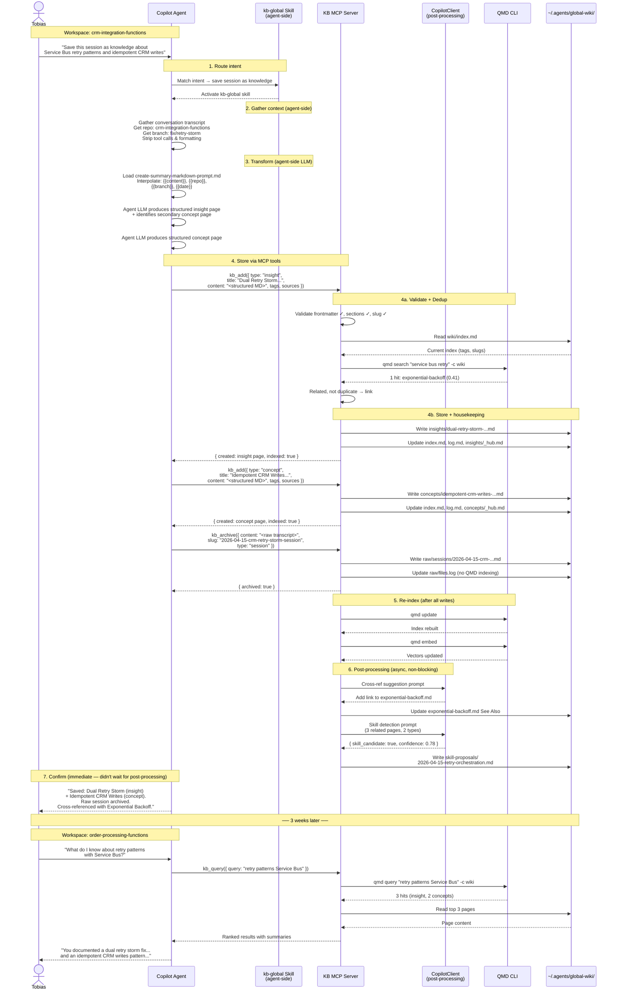

# Storyline — "Save this session as knowledge"

A walkthrough of how the Global KB MCP Server behaves in practice. One fictive scenario, end to end.

---

## The Setup

**Developer:** Tobias, integration developer.
**Workspace:** `c:\Repos\tspappsen\crm-integration-functions` — an Azure Functions project that handles CRM data sync between Dynamics 365 and a legacy ERP system.
**Session:** Tobias has just spent 45 minutes in Copilot Chat debugging a nasty retry storm. Service Bus messages were being retried with exponential backoff, but the Logic App downstream was *also* retrying, causing duplicate CRM writes. He found the fix: set `maxDeliveryCount: 1` on the Service Bus subscription and let the Logic App's built-in retry handle everything.

The conversation included:
- Root cause analysis (dual retry layers)
- Code changes to `host.json` and the Service Bus trigger binding
- A pattern for idempotent CRM writes using `If-Match` headers
- A decision to log poison messages to a dead-letter table instead of a separate queue

Tobias doesn't want to lose this. He's seen this retry pattern before — it'll come up again in another project.

---

## The Interaction

Tobias types into Copilot Chat:

> **Save this session as knowledge about Service Bus retry patterns and idempotent CRM writes**

---

## What Happens — The Human Story

### 1. The agent recognizes the intent

The agent sees "save this session as knowledge" and matches it to the `kb-global` skill (G9 — the thin routing skill). The skill tells the agent: *this is a `kb_ingest` call. Gather the session content, construct the intent hint, and call the MCP tool.*

### 2. The skill gathers context the server can't access

The `kb-global` skill activates. Unlike the MCP server (which runs as a separate process with no workspace access), the skill runs inside the Copilot agent and has full access to:

- **Conversation history** — the entire debugging session
- **Workspace metadata** — repo name (`crm-integration-functions`), branch (`fix/retry-storm`)
- **Local files** — the `host.json` changes, the trigger binding code

The skill gathers the conversation transcript, strips internal tool calls and formatting artifacts, and prepares the raw material.

### 3. The skill transforms content agent-side

The skill loads its bundled prompt template — `create-summary-markdown-prompt.md` — and interpolates the context only it can provide:

- `{{content}}` — the conversation transcript (~2400 tokens)
- `{{repo}}` — `crm-integration-functions`
- `{{branch}}` — `fix/retry-storm`
- `{{date}}` — 2026-04-15

The agent's native LLM processes the prompt and produces a structured summary page. The skill also recognizes that the conversation contains two distinct knowledge threads: (1) the retry storm diagnosis (an *insight* — a finding from a specific situation), and (2) the idempotent CRM writes pattern (a *concept* — reusable across contexts).

The skill produces two structured pages:

**Insight page:**

```markdown
---
title: "Dual Retry Storm — Service Bus + Logic Apps"
type: insight
tags: [service-bus, logic-apps, retry, dead-letter, crm, azure-functions]
sources: [session/crm-integration-functions/2026-04-15]
updated: 2026-04-15
---

# Dual Retry Storm — Service Bus + Logic Apps

## Meta data
crm-integration-functions
fix/retry-storm

## Intent & Context
Debugging duplicate CRM writes caused by overlapping retry layers
between Service Bus delivery retries and Logic App action retries.

## Finding

Service Bus subscriptions default to `maxDeliveryCount: 10`. Logic Apps
retry failed actions up to 4 times by default. Worst case: 10 × 4 = 40
attempts for a single message.

## Root Cause

Two independent retry loops with no coordination.

## Resolution

Set `maxDeliveryCount: 1` on the Service Bus subscription. Let the Logic
App's built-in retry policy be the single retry layer. Poison messages
go to the dead-letter queue → dead-letter Azure Table for investigation.

## See Also

- [[exponential-backoff]]
- [[idempotent-crm-writes-via-if-match]]
```

**Concept page:**

```markdown
---
title: "Idempotent CRM Writes via If-Match"
type: concept
tags: [idempotency, crm, odata, etag, dynamics-365, retry]
sources: [session/crm-integration-functions/2026-04-15]
updated: 2026-04-15
---

# Idempotent CRM Writes via If-Match

Make Dataverse/Dynamics 365 writes safe to retry by including the
entity's `@odata.etag` in an `If-Match` header. The server rejects
stale writes with 412, preventing duplicates and lost updates.

## How It Works
...

## See Also

- [[dual-retry-storm-service-bus-logic-apps]]
```

### 4. The skill calls the MCP server

The skill now makes two `kb_add` calls and one `kb_archive` call:

```
// Store the structured insight page
kb_add({
  type: "insight",
  title: "Dual Retry Storm — Service Bus + Logic Apps",
  content: "<the full structured markdown above>",
  tags: ["service-bus", "logic-apps", "retry", "dead-letter", "crm", "azure-functions"],
  sources: ["session/crm-integration-functions/2026-04-15"]
})

// Store the structured concept page
kb_add({
  type: "concept",
  title: "Idempotent CRM Writes via If-Match",
  content: "<the full structured markdown above>",
  tags: ["idempotency", "crm", "odata", "etag", "dynamics-365", "retry"],
  sources: ["session/crm-integration-functions/2026-04-15"]
})

// Archive the raw conversation transcript for provenance
kb_archive({
  content: "<the raw conversation transcript>",
  slug: "2026-04-15-crm-retry-storm-session",
  type: "session"
})
```

Control passes to the MCP server for each call.

### 5. The MCP server validates, dedup-checks, and stores

For each `kb_add` call, the server:

**Step 1 — Validate.** Checks the page against the template contract:
- Required frontmatter fields: `title`, `type`, `tags`, `sources`, `updated` ✓
- Required sections: opening summary, `## See Also` ✓
- Slug format: `dual-retry-storm-service-bus-logic-apps.md` ✓

**Step 2 — Dedup.** Reads `~/.agents/global-wiki/wiki/index.md` and scans for near-matches. Also runs `qmd search "service bus retry" -c wiki --json -n 5`. QMD returns one hit: `concepts/exponential-backoff.md` (score: 0.41). Related but not a duplicate — link, don't merge.

**Step 3 — Store.** Writes:
- `~/.agents/global-wiki/wiki/insights/dual-retry-storm-service-bus-logic-apps.md`
- `~/.agents/global-wiki/wiki/concepts/idempotent-crm-writes-via-if-match.md`

**Step 4 — Housekeeping:**
- Appends two rows to `wiki/index.md`
- Appends two entries to `wiki/log.md`
- Updates `wiki/insights/_hub.md` and `wiki/concepts/_hub.md`
- Adds a reverse link to `concepts/exponential-backoff.md`'s See Also section
- Runs `qmd update && qmd embed` to re-index

The `kb_archive` call simply writes the raw transcript to `raw/sessions/2026-04-15-crm-retry-storm-session.md` and updates `raw/files.log`. No QMD indexing — raw sessions are preserved, not searched.

### 6. The MCP server runs post-processing (async)

After the `kb_add` response is returned to the agent, the server fires off post-processing in the background:

**Cross-reference suggestions:** The CopilotClient evaluates the new pages against existing pages and suggests additional wikilinks. It adds `[[dual-retry-storm-service-bus-logic-apps]]` to the existing `exponential-backoff` page's See Also.

**Skill detection:** The CopilotClient evaluates whether the new pages, combined with `exponential-backoff`, form a skill-worthy pattern. Three related pages across two page types, with procedural knowledge and clear trigger phrases... confidence: 0.78. A proposal is filed to `skill-proposals/2026-04-15-retry-orchestration.md`.

### 7. The agent confirms to Tobias

The `kb_add` responses come back immediately (post-processing is async). The agent renders:

> **Saved to global knowledge base:**
>
> - **Insight:** Dual Retry Storm — Service Bus + Logic Apps
>   Tags: `service-bus`, `logic-apps`, `retry`, `dead-letter`, `crm`, `azure-functions`
>
> - **Concept:** Idempotent CRM Writes via If-Match
>   Tags: `idempotency`, `crm`, `odata`, `etag`, `dynamics-365`, `retry`
>
> Raw session transcript archived for provenance.
> Cross-referenced with existing page: *Exponential Backoff*. No duplicates found.

Tobias nods and moves on.

---

## Three Weeks Later

Tobias opens a completely different workspace — `c:\Repos\tspappsen\order-processing-functions`. He's building a new order sync flow and vaguely remembers solving a retry problem before. He types:

> **What do I know about retry patterns with Service Bus?**

The agent recognizes this as a `kb_query` call. The MCP server runs `qmd query "retry patterns Service Bus" -c wiki --json -n 5`. It returns the insight page, the exponential backoff concept, and the idempotent writes concept — ranked by relevance.

The agent summarizes the results, and Tobias has his answer in seconds. The knowledge survived the workspace boundary.

---

## Sequence Diagram



---

## What Made This Work

| Concern | How it was handled |
|---------|--------------------|
| **Workspace boundary** | The skill (agent-side) gathered context; the MCP server received structured markdown in tool payloads. The server never touched workspace files. |
| **Unstructured → structured** | The skill's prompt template + the agent's native LLM did the transformation. The skill has access to conversation history, repo name, branch — context the server can't see. |
| **QMD indexes summaries, not noise** | QMD indexes `wiki/` (structured, tagged, cross-referenced pages). Raw transcripts in `raw/sessions/` are preserved for provenance but not searched — so retrieval always hits the distilled knowledge. |
| **Dedup** | The server checked the global index and QMD before writing. The existing `exponential-backoff` concept was linked, not duplicated. |
| **Multi-page extraction** | The skill (not the server) recognized two knowledge threads in one conversation and produced two pages. The agent LLM is better at this — it saw the full conversation. |
| **Cross-workspace recall** | Three weeks later, different workspace, same knowledge. QMD hybrid search found it instantly. |
| **No pre-configuration** | Tobias didn't set up anything per-workspace. The MCP server entry in his global VS Code settings was the only setup, done once. |
| **Emergent skill detection** | Post-processing (async, non-blocking) noticed 3 related pages forming a pattern and filed a skill proposal. Tobias didn't ask for it — the KB is self-aware. |
| **Server stays simple** | The MCP server is a storage + indexing engine with optional post-processing. It doesn't need to parse conversations, classify content, or run complex LLM chains. That's the skill's job. |
